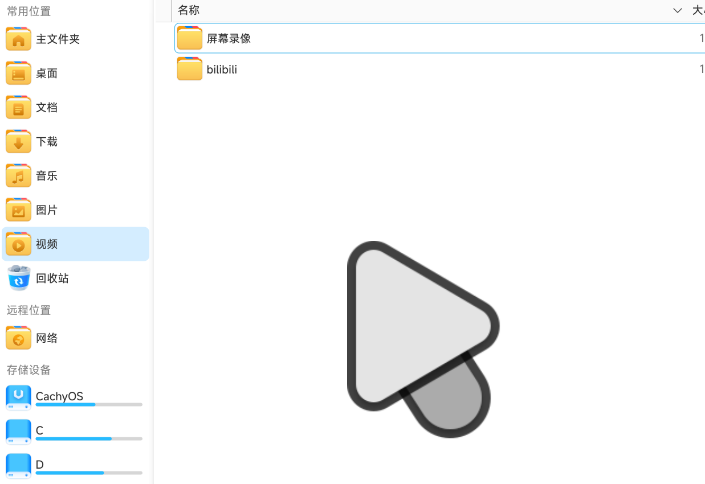
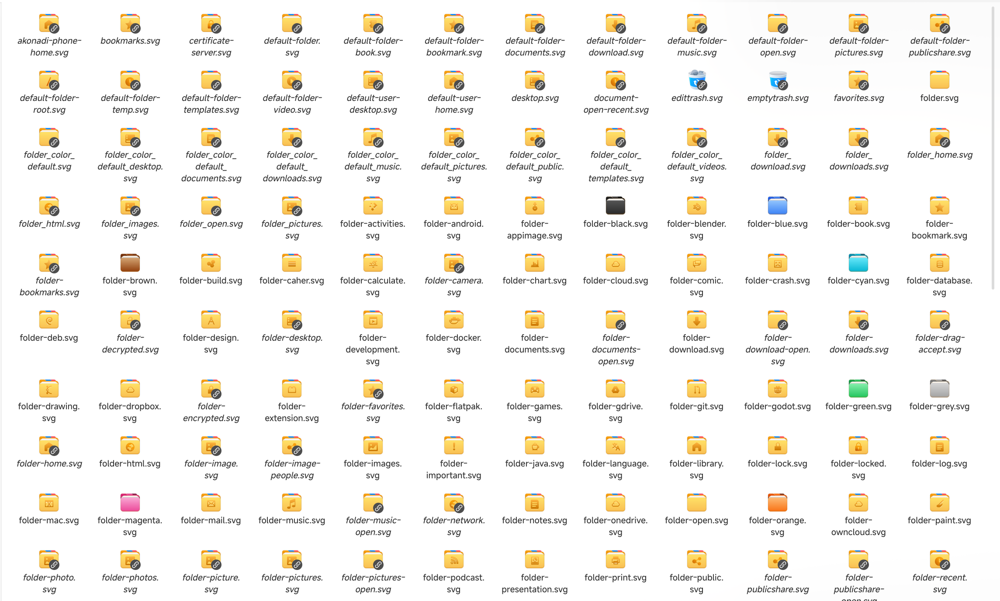
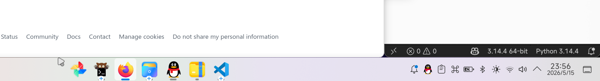
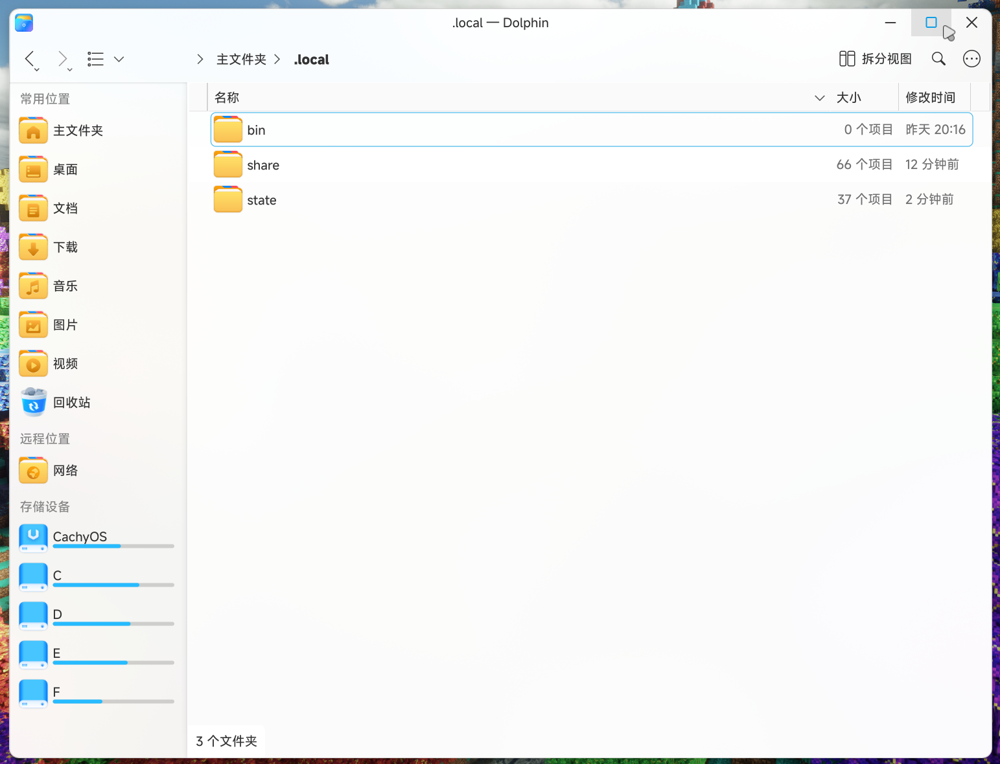

# DeepinExp-kde

在 KDE Plasma 桌面复刻深度（deepin）操作系统的主题，目前仅支持了浅色模式。

## 预览

### Fcitx5 输入法


### 鼠标指针



> KDE 的「晃动鼠标以定位指针」（Shake Cursor）功能在放大动画时不会出现指针边缘模糊的问题。

---

## 概览

| 组件 | 来源 | 修改说明 |
|------|------|---------|
| **图标** | 基于 Reversal-icon-theme | 参考 deepin 主题商店的「Youth」重绘了大量图标 |
| **Plasma 桌面主题** | 基于 Win11OS-light | 修复模糊背景透明度与桌面图标 hover/active 显示 bug |
| **Fcitx5 输入法主题** | 基于 Ori-fcitx5 | 避免 deepin 原版在 XWayland 下的显示 bug |
| **窗口装饰器** | Klassy 原创主题 | 灵感来自 deepin-gtk3-theme |
| **鼠标指针** | 基于 material_light_cursors | 修复 KDE 晃动鼠标放大功能时的模糊问题 |
| **配色方案** | 无 | DeepinExpLight |

---

## 组件详情

### 图标 — DeepinExp-icons

修改自 [Reversal-icon-theme](https://github.com/yeyushengfan258/Reversal-icon-theme)，根据 deepin 主题商店的「Youth」风格重绘了大量应用图标、文件夹图标、状态图标等，涵盖了 actions / apps / categories / devices / emblems / emotes / mimes / places / status / preferences 等完整上下文，总计 **9400+** 个 SVG 图标。



### Plasma 桌面主题 — Win11OS-light-patched

修改自 [Win11OS-kde](https://github.com/yeyushengfan258/Win11OS-kde)，主要修复：
- 窗口模糊时背景透明度过低导致文字难以辨认的问题
- 桌面图标 hover（悬停）与 active（激活）状态同时存在时的显示 bug

> **注意**：本图中启动器图标设置为 `deepin-launcher`。



### Fcitx5 主题 — deepinExp-light

修改自 [Ori-fcitx5]((https://github.com/Reverier-Xu/Ori-fcitx5))，deepin 自带输入法主题在 XWayland 下候选框显示位置偏移或闪烁，此版本修正了该问题。


### Klassy 窗口装饰器 — DeepinExp.klpw

原创 Klassy 窗口装饰器主题，设计语言参考 [deepin-gtk3-theme](https://github.com/linuxdeepin/deepin-gtk3-theme)，在 Klassy 窗口装饰引擎上实现深度的窗口按钮布局与配色风格。

> **注意**：需要安装 [Klassy](https://github.com/paulmcauley/klassy) 窗口装饰引擎才能使用 `.klpw` 文件。



### 鼠标指针 — material_light_cursors

修改自 [material_light_cursors](https://github.com/varlesh/material-cursors)，修复了 KDE 的「晃动鼠标以定位指针」功能（Shake Cursor）在放大动画时光标模糊的问题。


### 配色方案 — DeepinExpLight

Plasma 颜色方案，与图标和桌面主题配合使用以获得一致的 deepin 浅色风格。默认配色为不透明，如需半透明效果请在系统设置中启用窗口模糊。

(预览见上两图)

---

## 安装

将仓库克隆或下载到本地：

```bash
git clone https://github.com/你的用户名/DeepinExp-kde.git
cd DeepinExp-kde
```

然后将各组件复制到对应的 KDE 用户目录。**根据你的用户名替换下方命令中的 `xxx`**。

### 图标

```bash
cp -r icons/DeepinExp-icons ~/.local/share/icons/
```

然后在「系统设置 → 外观 → 图标」中选择 **DeepinExp**。

### Plasma 桌面主题

```bash
cp -r desktoptheme/Win11OS-light-patched ~/.local/share/plasma/desktoptheme/
```

在「系统设置 → 外观 → 全局主题 / Plasma 风格」中选择 **Win11OS-light-patched**。

### Fcitx5 主题

```bash
mkdir -p ~/.local/share/fcitx5/themes/
cp -r fcitx5/deepinExp-light ~/.local/share/fcitx5/themes/
```

然后在 Fcitx5 配置工具（`fcitx5-configtool`）或 `~/.config/fcitx5/conf/classicui.conf` 中设置：

```ini
Theme=deepinExp-light
```

### Klassy 窗口装饰器

```bash
cp Klassy/DeepinExp.klpw ~/.local/share/klassy/
```

在「系统设置 → 应用程序风格 → Klassy → 窗口装饰」中导入并选择 **DeepinExp**。

### 鼠标指针

```bash
cp -r cursors/material_light_cursors ~/.local/share/icons/
```

在「系统设置 → 外观 → 光标」中选择 **Material Light Cursors**。

### 配色方案

```bash
cp color-schemes/DeepinExpLight.colors ~/.local/share/color-schemes/
```

在「系统设置 → 外观 → 颜色」中选择 **DeepinExpLight**。

---

## 一键安装脚本

将所有组件一次性复制到位：

```bash
#!/bin/bash
# DeepinExp-kde 一键安装脚本
# 用法: bash install.sh

ICON_DEST="$HOME/.local/share/icons/"
THEME_DEST="$HOME/.local/share/plasma/desktoptheme/"
FCITX_DEST="$HOME/.local/share/fcitx5/themes/"
KLASSY_DEST="$HOME/.local/share/klassy/"
COLOR_DEST="$HOME/.local/share/color-schemes/"
CURSOR_DEST="$HOME/.local/share/icons/"

mkdir -p "$ICON_DEST" "$THEME_DEST" "$FCITX_DEST" "$KLASSY_DEST" "$COLOR_DEST" "$CURSOR_DEST"

cp -r icons/DeepinExp-icons "$ICON_DEST"
cp -r desktoptheme/Win11OS-light-patched "$THEME_DEST"
cp -r fcitx5/deepinExp-light "$FCITX_DEST"
cp Klassy/DeepinExp.klpw "$KLASSY_DEST"
cp color-schemes/DeepinExpLight.colors "$COLOR_DEST"
cp -r cursors/material_light_cursors "$CURSOR_DEST"

echo "DeepinExp-kde 组件已复制完成。"
echo "请在系统设置中分别选择各组件以启用。"
```

---

## 依赖

- **Plasma 桌面**: 仅在 KDE Plasma 6.5.x 测试
- **窗口装饰器**: [Klassy](https://github.com/paulmcauley/klassy)（需单独安装）
- **输入法**: Fcitx5
- **应用程序主题**: 建议使用 [Darkly](https://github.com/Bali10050/Darkly) 以获得更相似的体验

---

## 致谢

- [Deepin](https://www.deepin.org) — 灵感来源
- [Reversal-icon-theme](https://github.com/yeyushengfan258/Reversal-icon-theme) — 图标基础
- [Win11OS-kde](https://github.com/yeyushengfan258/Win11OS-kde) — 桌面主题基础
- [deepin-gtk3-theme](https://github.com/linuxdeepin/deepin-gtk3-theme) — 窗口装饰器灵感
- [material_light_cursors](https://github.com/varlesh/material-cursors) — 鼠标指针基础
- [Ori-fcitx5](https://github.com/Reverier-Xu/Ori-fcitx5) — Fcitx5 主题基础
- deepin 主题商店「Youth」 — 图标重绘参考

---

## 许可

各组件沿用其上游项目的许可协议。修改部分遵循相同许可。